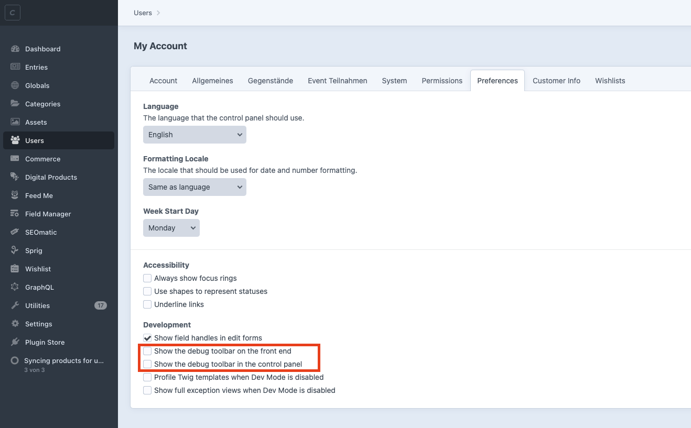
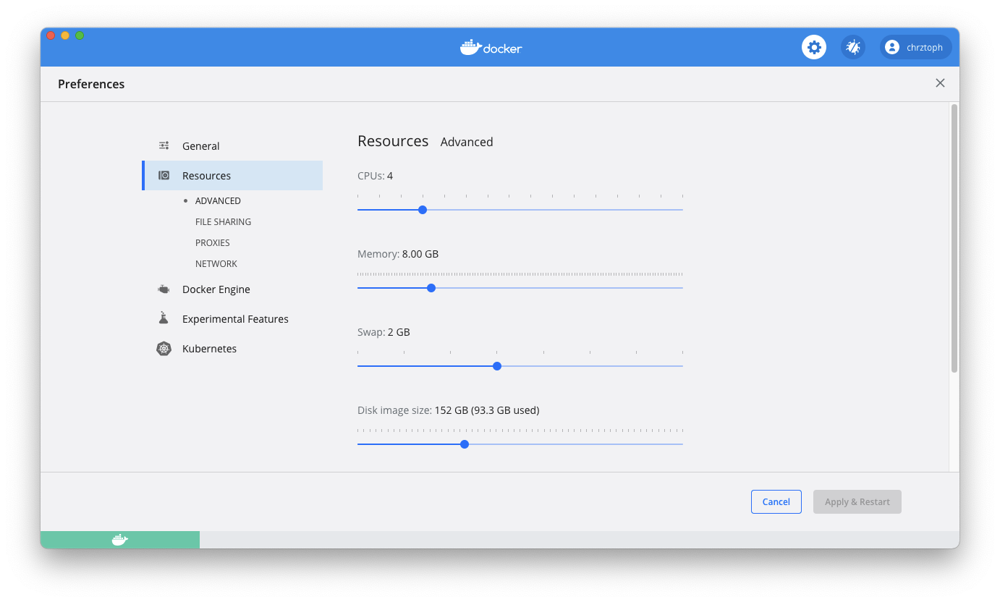

# Craft CMS development performance tips

Tips which can help to speed up Craft CMS development. I experienced loading times of **30s** and got it down to about **2s** with the tips listed below.

* [Performance tips](#performance-tips)
    + [Disable debug toolbar](#disable-debug-toolbar)
    + [Increase resources for Docker](#increase-resources-for-docker)
    + [Disable additional loaded resources](#disable-additional-loaded-resources)
    + [Disable que](#disable-que)
    + [Disable dev mode](#disable-dev-mode)
    + [Adjust Craft Nitro settings](#adjust-craft-nitro-settings)
    + [Disable Xdebug](#disable-xdebug)
* [Anything missing](#anything-missing)

## Performance tips

### Disable debug toolbar

To disable the [Yii Debug Toolbar](https://yii2-framework.readthedocs.io/en/stable/guide/tool-debugger/) in Craft CMS (usually shown at the bottom of the site) go to your account settings (https://your-dev-domain.nitro/admin/myaccount#prefs) and then disable the following options under the tab `Preferences`:

- `Show the debug toolbar on the front end`
- `Show the debug toolbar in the control panel`



### Increase resources for Docker

Depending on the size of your application Docker might hit the resource limits, so increasing them can result in way better performance during development.



### Disable additional loaded resources

If you make use of some third-party scripts and you don't actually need them, try to disable or remove them. For example, if you use a service like [Usersnap](https://usersnap.com/) try to disable it locally and see if it improves performance (for Usersnap search for `usersnap` to find the included script and remove it).

### Disable que

Your website might be slowed down during development, because of tasks in the que that are being executed. To disable it set `'runQueueAutomatically' => false` in your `general.php` file for the dev environment. Notice that disabling the que can make your website stop working properly, because potential necessary tasks are not being executed anymore. Also plugins often put some tasks into the que even if you don't create your own tasks. Keep this in mind if something is not working as expected, that it might be because of the disabled que.

### Disable dev mode

Craft CMS has a development mode which enables a lot of stuff like writing extensive logs, which can cause your website to slow down (read more about it [here](https://craftcms.com/knowledge-base/what-dev-mode-does)). To disable it set `'devMode' => false` in your `general.php` file for the dev environment. Be aware of the things that are no longer working, because of the disabled dev mode, by reading [here](https://craftcms.com/knowledge-base/what-dev-mode-does).

###  Adjust Craft Nitro settings

You can try to change some settings by entering `nitro iniset` and changing them to the following values:

- `opcache_enable: true`
- `opcache_revalidate_freq: 0`
- `opcache_validate_timestamps: 1`

Read more about those options [here](https://www.php.net/manual/en/opcache.configuration.php).


### Disable Xdebug

If you are not using [Xdebug](https://xdebug.org/) you can disable it by issuing the following command:

```sh
nitro xoff
```

Learn more [here](https://craftcms.com/docs/nitro/2.x/xdebug.html).

## Anything missing

If you have any further tips to increase Craft CMS development performance let me know by sending me a pull request or opening an issue.
